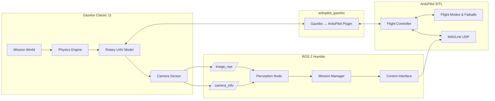
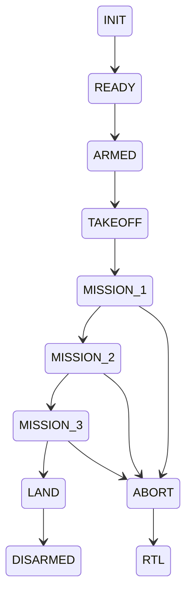

# System Architecture

**SAÜRO Teknofest Döner Kanat İHA – Simulation & Software Architecture**

This document defines the software and simulation architecture designed to accomplish
the **three rotary-wing UAV missions** defined in the Teknofest Döner Kanat İHA
specification. The architecture is aligned with the provided **Competition Specification,
Software Analysis Document, and Phase-1 Meeting Outputs**.

---

## 1. Purpose and Alignment

### Purpose

The goal of this architecture is to:

- Enable **fully autonomous mission execution**
- Support **repeatable simulation-based validation**
- Ensure **traceability** between competition requirements and software components

### Mission Scope (Rotary-Wing Category)

The architecture is designed to support:

1. **Mission 1 – Autonomous Flight & ∞ Maneuver (Unloaded)**
2. **Mission 2 – Payload Carry & Mission Execution**
3. **Mission 3 (Optional) – Advanced Payload / Vision-Based Task**

Each mission is mapped to explicit software responsibilities and runtime components.

---

## 2. High-Level Architecture Overview

### WIP MERMAID DIAGRAM

---

## 3. Mission-Oriented Software Decomposition

### 3.1 Mission Manager (Core Logic)

Responsible for:

- Mission sequencing (Mission 1 → Mission 2 → Mission 3)
- State-machine based execution
- Safety-aware transitions (abort, RTL, land)

### 3.2 Perception Layer

- Consumes camera data from ROS 2
- Performs:
  - Target detection
  - Reference pole detection
  - Payload zone estimation (for advanced missions)
- Outputs structured perception results to Mission Manager

### 3.3 Control Layer

- Converts mission decisions into MAVLink commands
- Handles:
  - Arm / Disarm
  - Takeoff / Land
  - Velocity & position control
  - Mode switching

---

## 4. Mission Mapping to Architecture

### Mission 1 – Autonomous Flight & ∞ Maneuver

**Requirements**

- Fully autonomous takeoff
- Stable flight
- Horizontal infinity (∞) maneuver around reference poles

**Software Responsibilities**

- Mission Manager: State sequencing
- Control Layer: Waypoint & velocity control
- ArduPilot SITL: Flight stabilization & PID

---

### Mission 2 – Payload Carry Mission

**Requirements**

- Autonomous flight with payload
- Stable maneuvering under load
- Safe mission completion

**Software Responsibilities**

- Mission Manager: Payload-aware constraints
- Control Layer: Adjusted velocity & acceleration
- Safety Monitor: Battery & stability checks

---

### Mission 3 – Optional Advanced / Vision-Based Mission

**Requirements**

- Vision-assisted decision making
- Autonomous task execution
- Minimal human intervention

**Software Responsibilities**

- Perception Node: Vision processing
- Mission Manager: Conditional logic
- Control Layer: Precision maneuvering

---

## 5. Runtime Data Flow

### Camera Pipeline

1. Gazebo camera sensor generates frames
2. gazebo_ros_camera publishes:
   - `/iris_camera/image_raw`
   - `/iris_camera/camera_info`
3. cv_bridge converts to OpenCV format
4. Perception node extracts mission-relevant features

### Control Pipeline

1. Mission Manager evaluates current state
2. Control interface generates MAVLink messages
3. ArduPilot SITL applies control outputs
4. Updated vehicle state is fed back to Gazebo

---

## 6. ROS 2 Interfaces

| Topic                    | Type                   | Publisher       | Subscriber      | Purpose     |
| ------------------------ | ---------------------- | --------------- | --------------- | ----------- |
| /iris_camera/image_raw   | sensor_msgs/Image      | Gazebo          | Perception      | Vision      |
| /iris_camera/camera_info | sensor_msgs/CameraInfo | Gazebo          | Perception      | Calibration |
| /mission/state           | std_msgs/String        | Mission Manager | Debug           | State       |
| /perception/output       | custom                 | Perception      | Mission Manager | Decisions   |

---

## 7. Flight Lifecycle State Machine

### WIP MERMADID DIAGRAM

---

## 8. Safety and Failsafe Design

- Battery monitoring
- Loss of vision input handling
- MAVLink heartbeat supervision
- Automatic RTL / LAND on fault detection

---

## 9. Simulation Validation Strategy

- Each mission validated independently in Gazebo
- Parameter tuning performed in SITL
- Vision algorithms tested with recorded ROS bags
- Failure cases explicitly simulated

---

## 10. Extensibility

- Multi-sensor support (LiDAR, depth camera)
- Transition to real hardware (HITL)
- MAVROS integration
- Gazebo Fortress migration

---

## 11. Document Traceability

This architecture directly derives from:

- Teknofest Döner Kanat İHA Competition Specification
- SAÜRO Software Analysis Document
- Phase-1 Technical Review Outputs

---

**End of Architecture Document**
